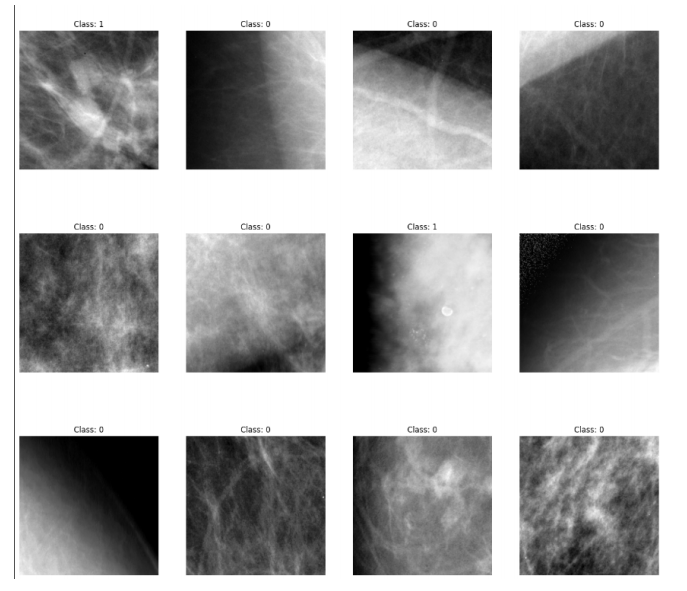
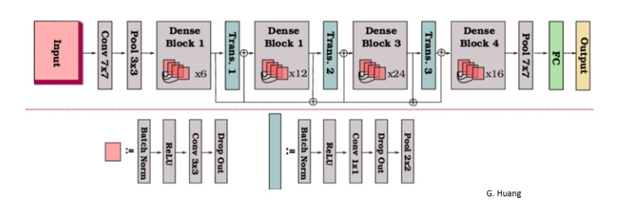
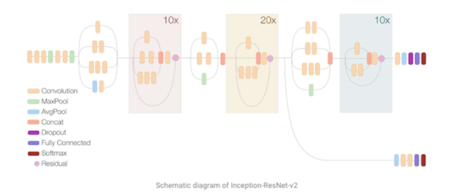
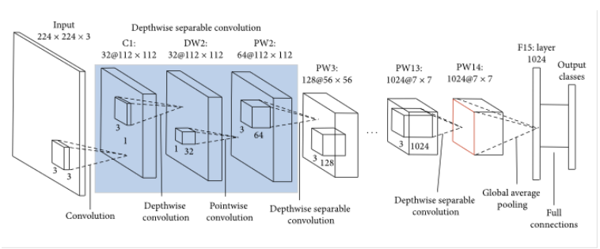
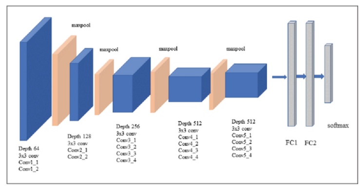
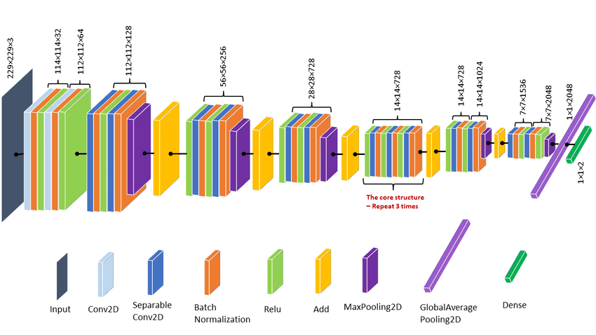
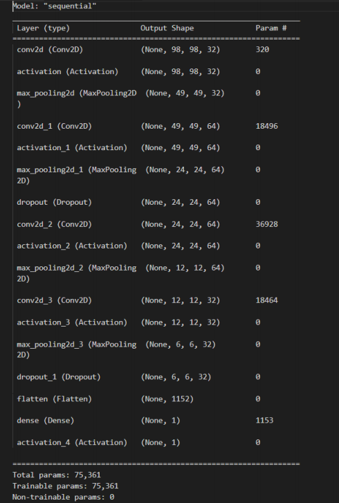
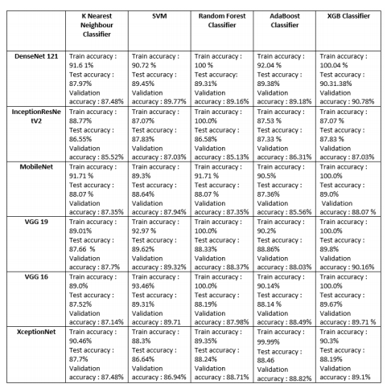
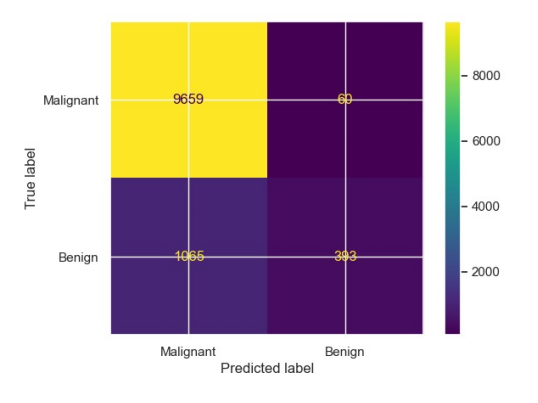
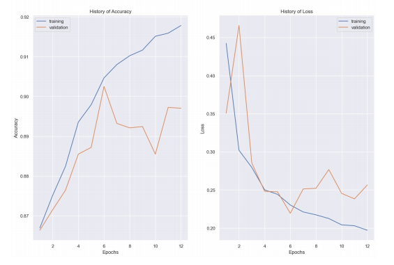

<!DOCTYPE html>
<html>
  <body>
    <h1>Mammogram Analysis using Deep Learning</h1>
    
Breast cancer is a leading cause of death among women worldwide. Early detection through mammogram screening has been shown to significantly improve survival rates. Deep learning models have emerged as a promising approach for mammogram image classification, with various architectures, such as Densenet, CNN, VGG16, VGG19, Xception, and Mobilenet, being widely used for feature extraction. This repository includes the implementations of these models.

    <h2>Dataset</h2>
    
The dataset consists of negative images from the DDSM dataset and positive images from the CBIS-DDSM dataset. The data was pre-processed to convert it into 299x299 images.The negative (DDSM) images were tiled into 598x598 tiles, which were then resized to 299x299.The positive (CBIS-DDSM) images had their ROIs extracted using the masks with a small amount of padding to provide context. Each ROI was then randomly cropped three times into 598x598 images, with random flips and rotations, and then the images were resized down to 299x299.The images are labeled with two labels:  Label 0 : Benign Sample   Label 1 : Malignant   Here are a few image samples. 

    
    <h2>DenseNet Model</h2>
    
    
Figure 1 : Densenet Architecture

    
DenseNet169 is a powerful convolutional neural network architecture that has shown impressive results in image classification tasks. It has been used in various applications, including medical imaging, where it has shown promising results in detecting and diagnosing diseases such as breast cancer.In mammography, DenseNet169 can be used for feature extraction, which involves using the pre-trained model to extract a set of features from the mammography images. These features can then be used as inputs to train a machine learning classifier to distinguish between benign and malignant breast tumors.

    <h2>InceptionResNet V2 Model</h2>
    
    
Figure 2 : InceptionResNet V2 Architecture

    
InceptionResNetV2 is a deep neural network architecture that combines the Inception architecture with residual connections, resulting in a more efficient and accurate model.To use InceptionResNetV2 for feature extraction in mammography images, the first step is to create a model using pre-trained weights on ImageNet. The model is then used to extract features from the mammography images by passing them through the model and capturing the output of the final convolutional layer. These features arethen   used   as   inputs   to   train  a  machine  learning  classifier  to  distinguish between  benign  and  malignant  breast  tumors.

     <h2>MobileNet Model</h2>
    
    
Figure 3 : MobileNet V2 Architecture

    
MobileNet is a lightweight deep neural network architecture that has been specifically designed for mobile devices with limited computational resources. This architecture achieves a good trade-off between accuracy and complexity, making it suitable for applications where computational resources are limited, such as mobile devices or embedded systems.
To use MobileNet for feature extraction in mammography images, the first step is to create a model using pre-trained weights on ImageNet. The model is then used to extract features from the mammography images by passing them through the model and capturing the output of the final convolutional layer. These features are then used as inputs to train a machine learning classifier to distinguish between benign and malignant breast tumors.

    <h2>VGG19 Model</h2>
    
    
Figure 4 : VGG19 Architecture

    
The VGG19 model is a popular convolutional neural network architecture that has been widely used for image classification tasks. Itconsists    of    19    layers,    including    16 convolutional layers and 3 fully connected  layers.In this context, the VGG19 model is being used for feature extraction in mammography images. The model is pre-trained on the ImageNet dataset, which contains millions of images of various classes. By using transfer learning, the pre-trained VGG19 model can be used to extract meaningful features from the mammography images.The extracted features are then fed into various classifiers such as KNeighborsClassifier(), SVC(), RandomForestClassifier(), AdaBoostClassifier(), and XGBClassifier() to determine if the image is benign or malignant. These classifiers are trained on the extracted features and then used to predict the class of the test images.

     <h2>XceptionNet Model</h2>
    
    
Figure 5 : InceptionResNet V2 Architecture

    
The Xception model is a deep convolutional neural network that was introduced by Google in 2016. It is an extension of the Inception architecture, but uses depthwise separable convolutions instead of thetraditional convolutions used in Inception. The idea behind the Xception architecture is to separate the spatial and channel-wise correlations in the input data, allowing for more efficient and accurate feature extraction.In this code, we are using the Xception model as a feature extractor for mammography images. We pass the mammography images through the Xception model and obtain the feature maps as output. We then flatten these feature maps and use them as input to various classifiers to determine whether the image is benign or malignant.

     <h2>Custom CNN Model</h2>
    
    
Figure 6 : Custom CNN Architecture

    
The  CNN  model  consisted  of  four  convolutional  layers  with  varying numbers  of  filters,  followed  by  activation  functions,  max  pooling  layers, and  dropout  regularization.  The  last  layer  was  a  dense  layer  with  a single  neuron  and  a  sigmoid  activation  function  for  binary  classification of  benign  or  malignant  mammography  images.

    <h1>Results</h1>
    <h3>Comparitive Analysis</h3>
    
The table consists of the training , testing and validation accuracy of all the models

    
    <h3>CNN Results</h3>
    
Confusion Matrix

    
    
Accuracy and Loss

    
  </body>
</html>
